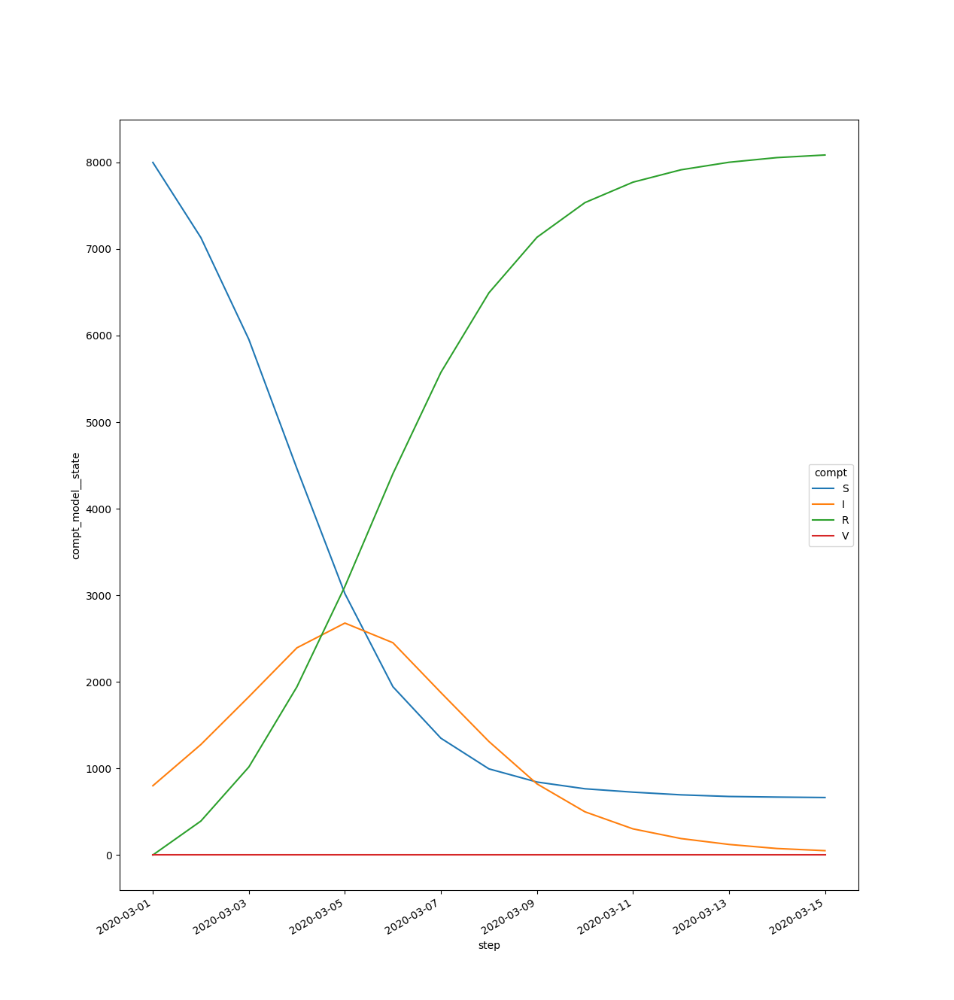

# Episimlab

[](https://github.com/UT-Covid/episimlab/actions/workflows/tox.yml)
[](https://github.com/UT-Covid/episimlab/actions/workflows/publish.yml)
[](https://colab.research.google.com/github/UT-Covid/episimlab/blob/main/examples/example_sirv.ipynb)

Episimlab is a Python package for rapid development and execution of contagion models. It provides a set of lightweight, reusable, and extensible Python [processes](https://xarray-simlab.readthedocs.io/en/latest/framework.html#processes) which can be combined into [models](https://xarray-simlab.readthedocs.io/en/latest/framework.html#models) with arbitrary complexity. While Episimlab was originally written with epidemiological use cases in mind, its applications extend to other fields such as computer security. This package specifically supports development of models that:

- Are Markovian
- Are stochastic or deterministic
- Are compartmental, with arbitrary network structure
- Run in discrete (as opposed to continuous) time
- Incorporate diverse data sources, such as census and cell phone mobility data
- Use parameters that are highly heterogeneous along multiple user-defined axes, such as age, risk group, and zip code
- Include dynamic interventions, such as starting vaccination when number of infections in an age group exceeds some limit
- Are performant, thanks to [Dask](https://docs.dask.org) integration and accelerated matrix math in [xarray](https://xarray.pydata.org) and [numpy](https://numpy.org/)
- Can be easily visualized in Jupyter or [Google Colab notebooks](https://colab.research.google.com/github/UT-Covid/episimlab/blob/main/examples/example_sirv.ipynb)

While Episimlab provides defaults for these behaviors, users can easily customize their models thanks to integration with the xarray-simlab package. For more details, please consult the documentation for [Episimlab](https://UT-Covid.github.io/episimlab/) and [xarray-simlab](https://xarray-simlab.readthedocs.io/).

## Example: A Basic Compartmental SIR Model

See the [full example here](./examples/example_sir.py).

```python
import xsimlab
# Import an existing SIR model 
from episimlab.models import ExampleSIR


@xsimlab.process
class CustomRecoveryRate:
    """We modify the model by writing a single custom process. This process
    calculates a recovery rate (`rate_I2R`)."""
    # Variables output by this process (intent='out')
    rate_I2R = xsimlab.variable(
        global_name='rate_I2R', groups=['edge_weight'], intent='out', 
        description="rate of change from compartments I to R")

    # Variables ingested by this process (intent='in'). 
    # Setting a `global_name` here allows this process to ingest from an 
    # upstream CalculateGamma process that would define gamma like:
    # gamma = xsimlab.global_ref('gamma', intent='out')
    gamma = xsimlab.variable(global_name='gamma', intent='in')

    # The state is the N-D array of every individual in the simulation,
    # stratified by age, risk group, geospatial identifier, compartment, etc.
    state = xsimlab.global_ref('state', intent='in')

    def run_step(self):
        """Re-calculate `rate_I2R` at every step of the simulation. We can
        instead decide to calculate only once at the beginning by renaming
        this method `initialize`. We calculate recovery rate as the product
        of `gamma` and the current state of the `I` compartment.
        """
        self.rate_I2R = self.gamma * self.state.loc[{'compt': 'I'}]


# Instantiate the included model
model = ExampleSIR()
# Edit the model so it uses our custom process
model.update_processes({'recovery_rate': CustomRecoveryRate})
results = model.run(input_vars={'gamma': 0.6})
model.plot()

# The final state is an N-D array represented in Python as an xarray.DataArray
# object (like a numpy array, but with labeled axes)
final_state = results['compt_model__state']
print(final_state)
# <xarray.DataArray 'compt_model__state' (step: 15, vertex: 4, compt: 4, age: 5, risk: 2)>
# array([[[[[200., 200.],
#           [200., 200.],
#           ...
#           [  0.,   0.],
#           [  0.,   0.]]]]])
# Coordinates:
#   * age      (age) object '0-4' '5-17' '18-49' '50-64' '65+'
#   * compt    (compt) object 'S' 'I' 'R' 'V'
#   * risk     (risk) object 'low' 'high'
#   * step     (step) datetime64[ns] 2020-03-01 2020-03-02 ... 2020-03-15
#   * vertex   (vertex) object 'Austin' 'Houston' 'San Marcos' 'Dallas'
```

### Results

#### Compartment populations over time



#### Compartment graph generated by `CustomSetupComptGraph` in the [full example](./examples/example_sir.py)


## Installation

### From PyPI

```bash
pip install episimlab
```

### Latest Release

To install the most recent (and potentially less stable) development release, install directly from the `main` branch of the GitHub repository:

```bash
pip install git+https://github.com/UT-Covid/episimlab
```

## Testing

### GitHub Actions

Pushing commits to a Pull Request against the `main` branch will automatically trigger pytests in GitHub Actions. Tests run in the poetry environment defined by the [`pyproject.toml`](./pyproject.toml) file.

### Local Testing

Preferred testing environment runs poetry virtual env within tox.
1. Install [tox](https://tox.readthedocs.io/) and [poetry](https://python-poetry.org/)
2. Run tox from repository root:
```bash
# Default args
tox
# Pass args to pytest. In this case, we run only the model tests
tox -- tests/test_models.py
```

## Contributing

If you are interested in contibuting to Episimlab, please see the [contribution guide](CONTRIBUTING.md).

## Troubleshooting

If you are having trouble using Episimlab, please first refer to the [documentation](https://UT-Covid.github.io/episimlab/) and [examples](./examples). If you're still having trouble, please [submit a GitHub issue](https://github.com/UT-Covid/episimlab/issues/new/choose).