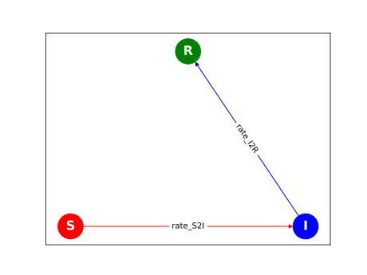

# Episimlab
[](https://github.com/eho-tacc/episimlab/actions/workflows/tox.yml)
[](https://github.com/eho-tacc/episimlab/actions/workflows/publish.yml)
[](https://colab.research.google.com/github/eho-tacc/episimlab/blob/main/examples/example_sirv.ipynb)

Episimlab is a framework for developing epidemiological models in a modular fashion. It provides a set of extensible components that can be combined with user-written components, allowing for rapid development of reproducible disease-modeling pipelines.

For more details, please consult the [Episimlab documentation](https://eho-tacc.github.io/episimlab/).

## Highlights

* **Fully integrated with the [`xarray-simlab`](https://xarray-simlab.readthedocs.io/) package -** Episimlab provides a library of [`xsimlab.process` ]() classes ("processes"), as well as a handful of commonly-used [`xsimlab.model`]()s ("models").
* **Extensible -** Users can quickly and easily develop their own process classes, either from scratch or based on an `episimlab` process, and include them in their models.
* **Any variable can be high-dimensional -** Want constant `beta` for all time points? Use the `ConstantBeta` process. Want `beta` with age and risk group structure? Use `AgeRiskBeta`. Want to add your own custom structure and read it from a CSV file? Quickly write your own process, and it will integrate with processes provided by `episimlab`. Better yet, push your new process in a [Pull Request](CONTRIBUTING.md) so that others can use it!
* **Good performance under the hood -** Frequently used processes - such as force of infection (FOI) calculation, SEIR disease progression, and travel between spatially separated nodes - use xarray, which takes advantage of accelerated matrix math in numpy and Dask. 

## Example: A Basic Compartmental (SIR) Model

See the [full example here](./examples/example_sir.py).

```python
import xsimlab
# Import an existing SIR model 
from episimlab.models import ExampleSIR


@xsimlab.process
class CustomRecoveryRate:
    """We modify the model by writing a single custom process. This process
    calculates a recovery rate (`rate_I2R`)."""
    # Variables output by this process (intent='out')
    rate_I2R = xsimlab.variable(
        global_name='rate_I2R', groups=['edge_weight'], intent='out', 
        description="rate of change from compartments I to R")

    # Variables ingested by this process (intent='in'). 
    # Setting a `global_name` here allows this process to ingest from an upstream 
    # CalculateGamma process that would define gamma like:
    # gamma = xsimlab.global_ref('gamma', intent='out')
    gamma = xsimlab.variable(global_name='gamma', intent='in')

    # The state is the N-D array of every individual in the simulation,
    # stratified by age, risk group, geospatial identifier, compartment, etc.
    state = xsimlab.global_ref('state', intent='in')

    def run_step(self):
        """Re-calculate `rate_I2R` at every step of the simulation. We can
        instead decide to calculate only once at the beginning by renaming
        this method `initialize`. We calculate recovery rate as the product
        of `gamma` and the current state of the `I` compartment.
        """
        self.rate_I2R = self.gamma * self.state.loc[{'compt': 'I'}]


# Instantiate the included model
model = ExampleSIR()
# Edit the model so it uses our custom process
model.update_processes({'recovery_rate': CustomRecoveryRate})
# Run the model using Dask and xarray-simlab (xsimlab)
results = model.run()
# Plot the state over time
model.plot()

# The final state is an N-D array represented in Python as an xarray.DataArray
# object (like a numpy array, but with labeled axes)
final_state = results['compt_model__state']
print(final_state)
# <xarray.DataArray 'compt_model__state' (step: 15, vertex: 4, compt: 4, age: 5, risk: 2)>
# array([[[[[200., 200.],
#           [200., 200.],
#           ...
#           [  0.,   0.],
#           [  0.,   0.]]]]])
# Coordinates:
#   * age      (age) object '0-4' '5-17' '18-49' '50-64' '65+'
#   * compt    (compt) object 'S' 'I' 'R' 'V'
#   * risk     (risk) object 'low' 'high'
#   * step     (step) datetime64[ns] 2020-03-01 2020-03-02 ... 2020-03-15
#   * vertex   (vertex) object 'Austin' 'Houston' 'San Marcos' 'Dallas'
```

### Results

#### Compartment populations over time


#### Compartment graph generated by `CustomSetupComptGraph` in the [full example](https://github.com/eho-tacc/episimlab/blob/main/examples/example_sir.py#L62-L73)



## Installation

### From PyPI

```bash
pip install episimlab
```

### Latest Edge

```bash
pip install git+https://github.com/eho-tacc/episimlab
```

## Testing

Preferred testing environment runs poetry virtual env within tox.
1. Install [tox](https://tox.readthedocs.io/) and [poetry](https://python-poetry.org/)
2. Run tox from repository root:
```bash
# Default args
tox
# Pass args to pytest. In this case, we use 4-thread parallelism to run only the model tests
tox -- tests/test_models.py
```
